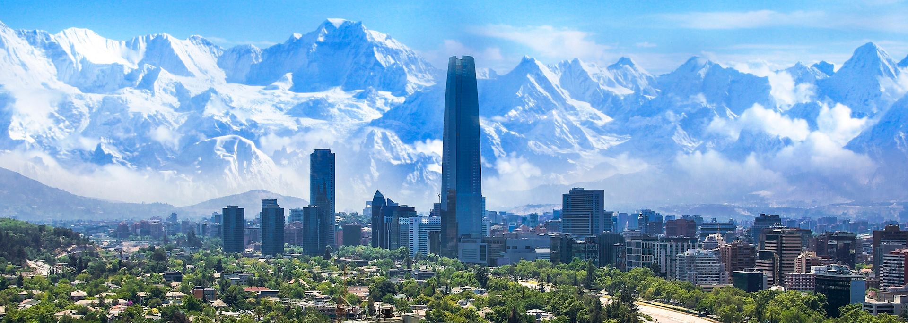

# Theory and Practice of Applied Predictive Groundwater Modeling
Materials and tutorials for the GMDIS Predictive Modeling Workshop in Santiago, 2025.

# Dates
8-9 September 2025, 9am-6pm

# Location
Club Providencia, Av. Pocuro 2878.

## MCs
- Jeremy White
- Ed de Sousa
- Pablo Ortega
- Rodrigo Herrera

## Software
This workshop consists of jupyter notebooks that use pyemu and pestpp to run all the good stuff from uncertainty analysis to optimization managemnt. This repository is self contained, meaning that all dependencies are included here and you should not needed to install anything else. We encourage everyone to clone this repository and install the environment using:


Este taller está compuesto por Jupyter Notebooks que utilizan PyeMU y pestpp para realizar desde análisis de incertidumbre hasta optimización automatica (terrible de bkn).
El repositorio es selfcontained, lo que significa que todas las dependencias necesarias se encuentran incluidas y no será necesario instalar nada adicional (incluso tenemos los ejecutables de modflow). Se recomienda a todos los participantes clonar este repositorio e instalar el environment:

```bash
conda env create -f environment.yml

conda activate gmdsi_tut